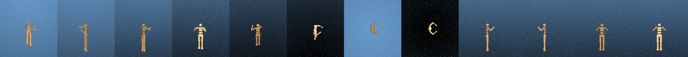
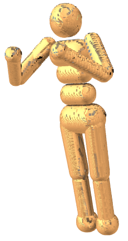

# MJCF2O3D



1. Take in MJCF file
2. Cleanup the file 
2. Spawn a ton of depth cameras around the robot
3. Capture a point cloud of the robot
4. Save the point cloud using Open3D

That's it!



### Acknowledgements

Thanks to [RoCo](https://github.com/MandiZhao/robot-collab) for the DM Control pointcloud creation logic.

### Cite

```
@software{mjcf2o3d,
  author = {{Charlie Gauthier}},
  title = {MJCF to Open3D},
  url = {},
  version = {0.20.2},
  date = {2010-02-19},
}
```