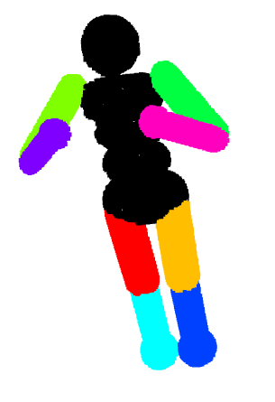

# MJCF2O3D


1. Take in MJCF file
2. Cleanup the file 
2. Spawn a ton of depth cameras around the robot
3. Capture a point cloud of the robot
4. Save the point cloud using Open3D

That's it!


# As a dataset creator

This repo can also isolate the geoms actuated by, uh, actuators.



# Installation 


**Supporting old MJCF files:** Past Mujoco 2.3.3, the support for "global" coordinates was removed. To convert old files to 
more recent versions of Mujoco, one must load them in 2.3.3 and save them to file.

**That's why we need two `venv` for this project.** In the first one, install all the requirements. 
This one's name doesn't matter. In the second, install `mujoco==2.3.3` (no other requirements). You must name it `venv_mujoco233` and place it 
at the root of this directory (so in the same file level as this `README.md`).

### Acknowledgements

Thanks to [RoCo](https://github.com/MandiZhao/robot-collab) for the DM Control pointcloud creation logic.

### Cite

```
@software{mjcf2o3d,
  author = {{Charlie Gauthier}},
  title = {MJCF to Open3D},
  url = {},
  version = {0.20.2},
  date = {2010-02-19},
}
```